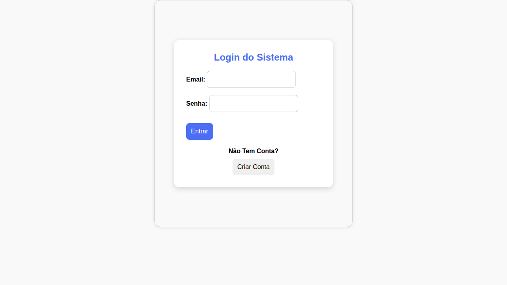
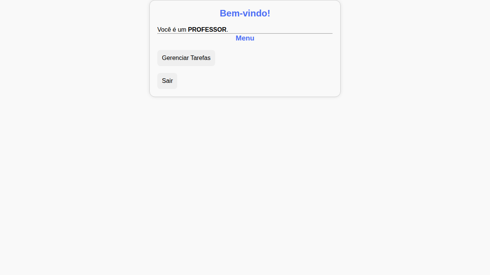
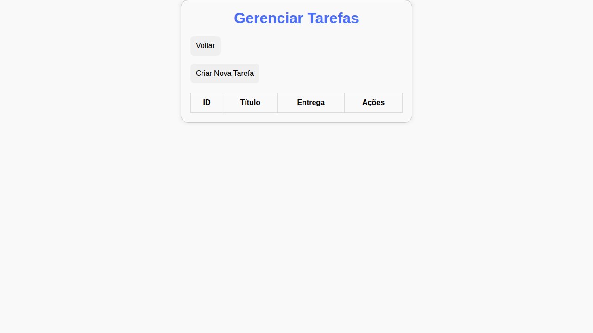
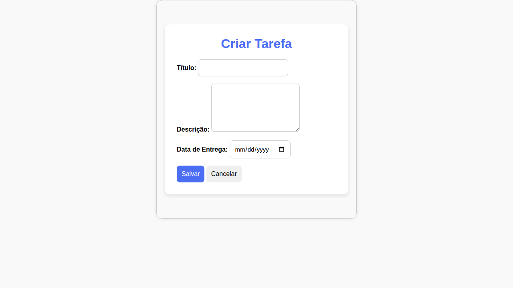
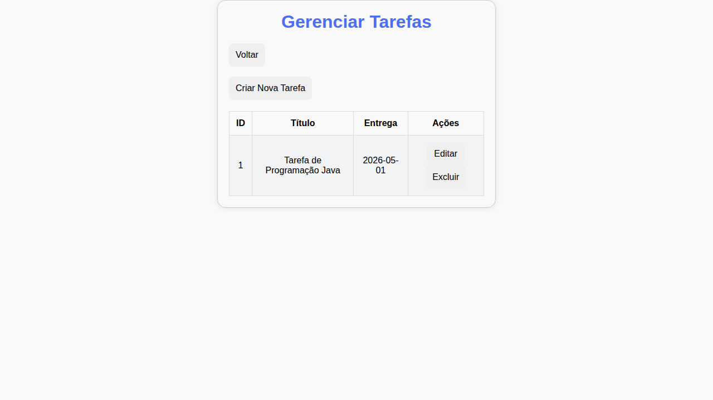
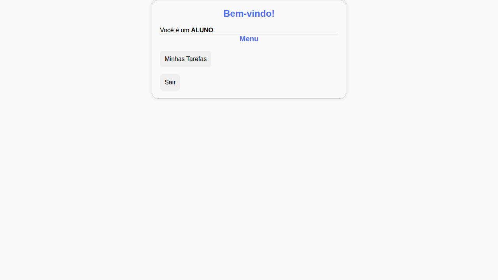
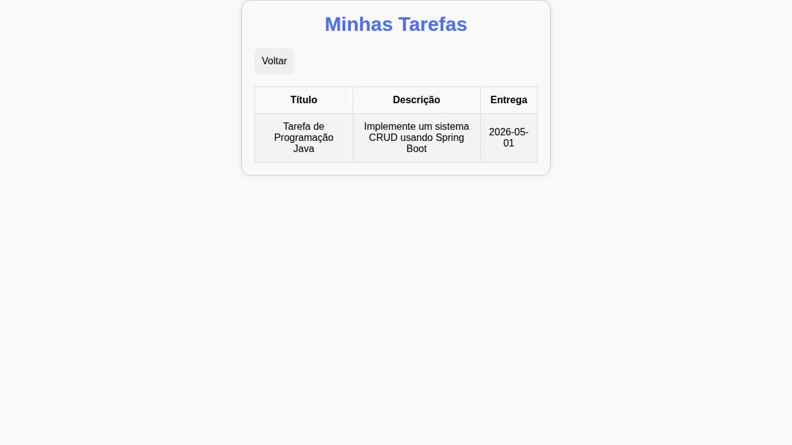
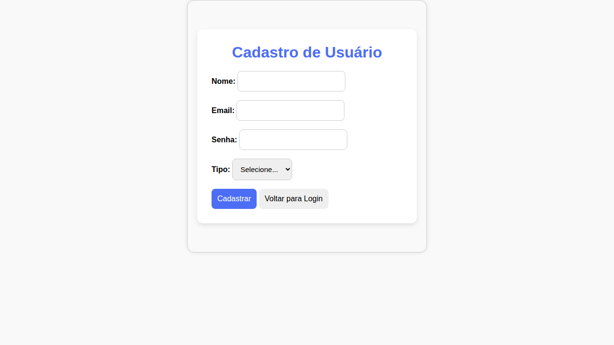

# ✅ Relatório de Execução do Projeto

## Status: **APLICAÇÃO FUNCIONANDO COM SUCESSO** ✅

O projeto foi executado com êxito em ambiente Linux com as seguintes configurações.

---

## 🛠️ Ambiente de Execução

| Ferramenta | Versão         |
|------------|----------------|
| Java       | OpenJDK 17.0.x |
| Maven      | 3.9.x          |
| MySQL      | 8.x            |
| SO         | Linux (Ubuntu) |

---

## 📋 Passos Realizados

### 1. Verificação dos pré-requisitos
```bash
java -version   # OpenJDK 17
mvn -version    # Maven 3.9.x
mysql --version # MySQL 8.x
```

### 2. Inicialização do MySQL e criação do banco
```bash
sudo service mysql start

mysql -u root -p -e "CREATE DATABASE IF NOT EXISTS sistema_tarefas
  CHARACTER SET utf8mb4 COLLATE utf8mb4_unicode_ci;"
```

### 3. Importação do schema SQL
```bash
mysql -u root -p sistema_tarefas < sistema_tarefas.sql
```

Tabelas criadas:
- `usuarios` — armazena professores e alunos
- `tarefas` — armazena as tarefas
- `vw_tarefas_proximas` — view auxiliar

### 4. Configuração do `application.properties`
O arquivo `src/main/resources/application.properties` já vem configurado com:
```properties
spring.datasource.url=jdbc:mysql://localhost:3306/sistema_tarefas?...
spring.datasource.username=root
spring.datasource.password=0405
```
> ⚠️ Altere `spring.datasource.password` para a senha do seu MySQL.

### 5. Build com Maven
```bash
cd sistema-tarefas
mvn clean package -DskipTests
```
✅ **BUILD SUCCESS** em ~18 segundos.

### 6. Execução
```bash
java -jar target/sistema-tarefas-0.0.1-SNAPSHOT.jar
```
ou
```bash
mvn spring-boot:run
```

A aplicação sobe em ~5 segundos e cria os usuários de teste automaticamente:
```
<<< Usuario professor criado: professor@sistema.com / 1234 >>>
<<< Usuario aluno criado: aluno@sistema.com / 1234 >>>
```

---

## 🌐 Telas Testadas

### Login (`http://localhost:8080/login`)


### Home do Professor


### Gerenciar Tarefas (Professor)


### Criar Nova Tarefa


### Lista de Tarefas Criadas


### Home do Aluno


### Minhas Tarefas (Aluno)


### Cadastro de Usuário


---

## 🔑 Credenciais de Teste

| Perfil    | E-mail                   | Senha |
|-----------|--------------------------|-------|
| Professor | professor@sistema.com    | 1234  |
| Aluno     | aluno@sistema.com        | 1234  |

---

## ✅ Funcionalidades Verificadas

- [x] Login com Spring Security (Professor e Aluno)
- [x] Home com menu diferenciado por perfil
- [x] Criar tarefa (Professor)
- [x] Listar tarefas (Professor)
- [x] Visualizar tarefas (Aluno)
- [x] Cadastro de novo usuário
- [x] Logout
- [x] Persistência no MySQL

---

## ⚠️ Requisitos Obrigatórios

Para executar o projeto, é **obrigatório** ter:

1. **Java 17** instalado
2. **MySQL 8** em execução local na porta 3306
3. Banco de dados `sistema_tarefas` criado
4. Usuário MySQL com permissão no banco
5. Senha correta configurada no `application.properties`

> Sem MySQL rodando, a aplicação **não inicia** (erro de conexão com o banco).
